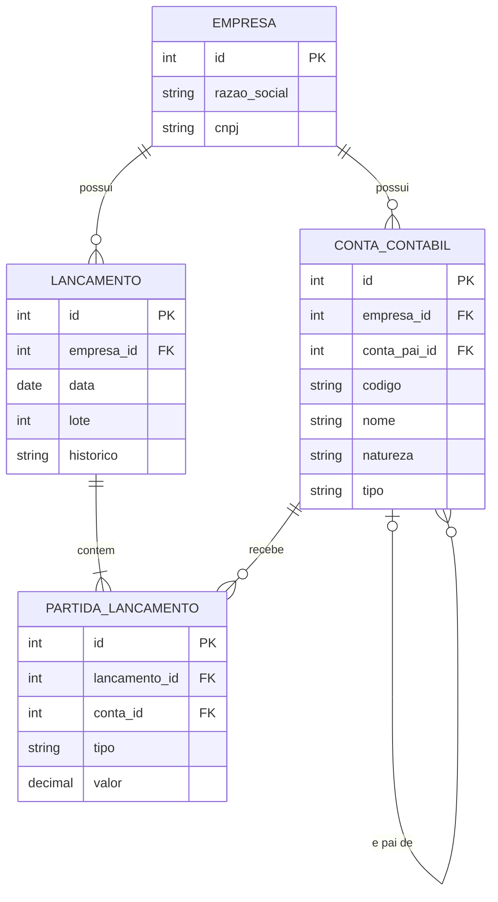

# Modelo de dados

Modelo entidade-relacionamento do módulo de contabilidade (milestone M1). Os valores monetários usam `Decimal`, nunca `float`.

## Diagrama

## Regras

- Toda tabela, exceto `EMPRESA`, tem `empresa_id`, para isolar os dados de cada empresa.
- Lançamentos só podem usar contas **analíticas**. Essa regra fica no domínio, com testes.
- Em cada lançamento, a soma dos débitos deve ser igual à soma dos créditos.
- Um lançamento tem ao menos uma partida de débito e uma de crédito.
- Valores monetários usam `Decimal`, armazenados com 2 casas decimais.
- Fora do M1: fechamento de período (M4), importação OFX (M5) e usuários (M8).
